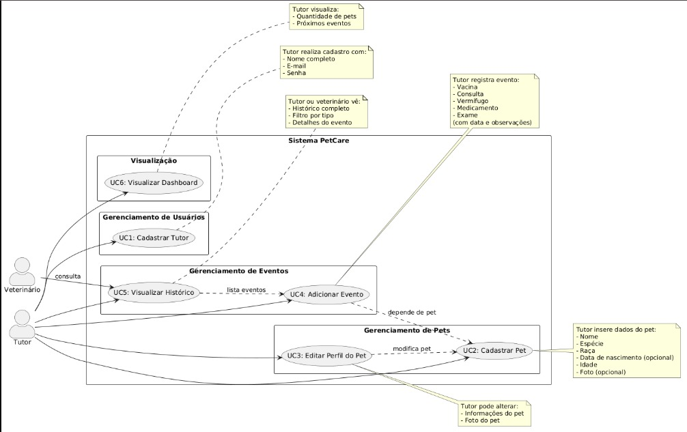

# PETCARE
## Sistema de Gestão de Cuidados com Pets
---

### Sobre o Projeto:

O PetCare é uma aplicação mobile desenvolvida para auxiliar tutores de pets no gerenciamento da saúde e bem-estar de seus animais. O sistema permite o registro e acompanhamento de vacinas, consultas veterinárias, vermifugações e medicamentos, centralizando todas as informações em um único local.

---

### Funcionalidades:

| Funcionalidade | Descrição |
|----------------|-----------|
| Cadastrar Tutor | Registro de novos usuários com nome, e-mail e senha |
| Cadastrar Pet | Registro de novos animais com nome, espécie, raça e data de nascimento |
| Editar Perfil do Pet | Atualização das informações cadastrais do animal |
| Adicionar Evento | Registro de vacinas, consultas, vermifugos e medicamentos |
| Visualizar Histórico | Listagem completa de todos os eventos de um pet |
| Visualizar Dashboard | Painel inicial com resumo dos pets e próximos eventos |

---

### Atores do Sistema:

**Tutor**
é o usuário principal do sistema, responsável por gerenciar os pets e seus eventos de saúde.

**Veterinário**
é o ator secundário que pode consultar o histórico de saúde do pet quando necessário.

---

### Diagrama de Casos de Uso:

O diagrama abaixo ilustra as interações entre os atores e as funcionalidades do sistema:



---

### Protótipo das Telas:

Foram desenvolvidas 6 interfaces no Figma, com navegação funcional entre todas as telas:

1. Tela de Login e Cadastro
2. Dashboard Principal
3. Lista de Pets
4. Perfil do Pet
5. Adicionar Evento
6. Calendário de Eventos

Protótipo disponível em: [Figma - Prototipagem Mobile](https://www.figma.com/design/wcxwg7jtiqSh9rwMNDQ3g8/Prototipagem---mobile?m=auto&t=mu3G2902WYTMLaWr-6)

---

### Tecnologias Utilizadas:

| Camada | Tecnologia |
|--------|------------|
| Front-end | React Native com Expo |
| Estilização | NativeWind (Tailwind CSS) |
| Navegação | Expo Router |
| Linguagem | TypeScript |
| Versionamento | Git e GitHub |

---

### Como Executar o Projeto:

#### Pré-requisitos:

- Node.js instalado (versão 18 ou superior)
- Gerenciador de pacotes npm ou yarn
- Aplicativo Expo Go instalado no celular (Android ou iOS)
- Git instalado

#### Passo a passo:

1. Clone o repositório:

```bash
git clone https://github.com/eduarda-cecilia06/PETCARE.git
```

2. Acesse a pasta do projeto:

```bash
cd PetCare
```

3. Instale as dependências: 

```bash
npm install
```

4. Inicie o projeto:
```bash
npm run start
```

5. Abra o aplicativo:
```bash
No celular: escaneie o QR Code que aparece no terminal com o app Expo Go

No navegador: pressione w no terminal

No emulador Android: pressione a no terminal
```

---

### Dupla:

| Nome | Responsabilidade |
|----------------|-----------|
| Ana Clara Siqueira Gouveia | Front-End, Design e Prototipação |
| Eduarda Cecília da Silva Melo | Back-End, Banco de Dados e Documentação |
